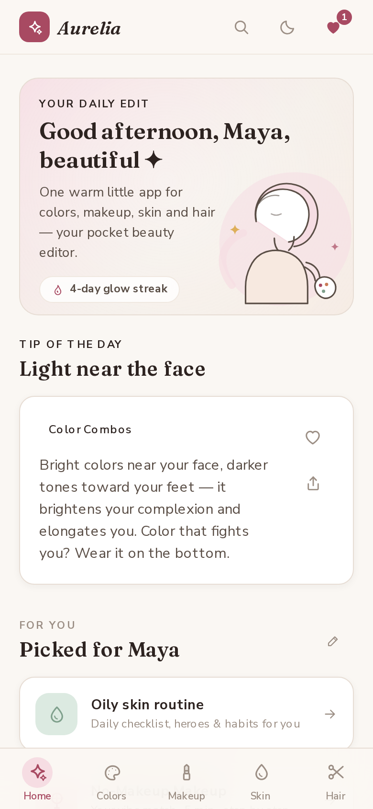

# Aurelia ✦ — your pocket beauty editor

A warm, clutter-free **PWA** for girls who want style & beauty knowledge without the noise: color combinations, makeup basics, skincare know-how and hairstyles — **all in one app**, installable, offline-capable, and fast on mobile.



## What's inside

| Pillar | Highlights |
| --- | --- |
| 🎨 **Colors** | 19-color match engine (what pairs with what + why), 15 curated outfit palettes, 60-second undertone finder, color theory crash course, 60-30-10 rule |
| 💄 **Makeup** | 5 occasion looks step-by-step, the golden 12-step application order, Face/Eye/Lip 101s, 10 beginner mistakes, myth-busting, tool care & expiry, double cleansing |
| 🌿 **Skincare** | 10-question skin-type quiz (oily / dry / combination / normal / sensitive), **daily AM/PM routine checklist**, 13-ingredient dictionary, mixing rules, sunscreen guide, 12 myths |
| 💇 **Hair** | Hairstyles matched to 8 outfit categories, 10 master styles with how-to, 6 face-shape guides, prep basics, bad-hair-day quick fixes |

Plus: daily rotating tips, palette of the day, saved favorites (works offline), share cards, global search, gentle glow streak.

## App features

- **PWA** — installable to home screen, works fully offline (service-worker app-shell caching), update prompt when a new version is ready
- **Global search** — one box across every color, look, ingredient, style and tip
- **Personalized onboarding** — name, skin type & style mood → "For you" picks and a greeting that knows you
- **Deep-linkable** — `#/colors`, `#/skin`… tab routes; Android back button closes sheets instead of leaving the app
- **Dark mode** (warm plum) · safe-area aware · reduced-motion support · zoom enabled (WCAG)
- **Custom SVG illustrations** — no stock photos, everything drawn in-house (Soft Editorial line-art style)
- **Branded 404 / error boundaries / offline fallback page**

## Tech

- Next.js 16 (App Router, Turbopack) · TypeScript
- Tailwind CSS v4 (`@theme` token system — Soft Editorial palette)
- Framer Motion (spring sheets, stagger entrances, tab pill)
- Zustand + persist (hydration-safe: `skipHydration` + post-mount rehydrate)
- Service worker with update flow · Web Share API + canvas share cards

## Run it locally

```bash
bun install        # or npm install
bun run dev        # http://localhost:3000
```

Production:

```bash
bun run build
bun run start
```

## Verify

```bash
bun run lint
node scripts/hydration-verify.mjs   # IST-timezone + persisted-state hydration check
node scripts/e2e-new-features.mjs   # full E2E: onboarding → search → deep-open → back → 404
```

## Project structure

```
src/
  app/                 # layout, page (tab router), 404, error boundaries, globals.css
  components/aurelia/  # shell, bottom sheet, bits, icons, illustrations, onboarding, search
  components/aurelia/tabs/   # home · colors · makeup · skin · hair
  data/                # content knowledge base (colors, makeup, skincare, hair, tips)
  lib/                 # store (zustand), search index, share utils
public/                # manifest, service worker, icons, splash screens, og image
docs/                  # research briefs (design, content, launch readiness)
```

---

Built with care — no clutter, no gatekeeping. 💗
